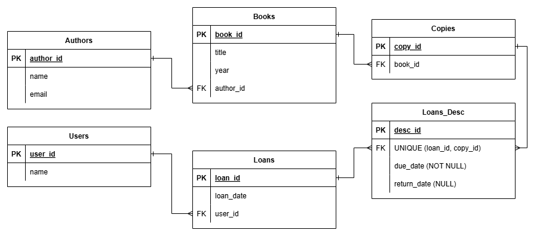

# ERD — Gestión de biblioteca
# 

## 1) Lista de tablas

- `Authors` — catálogo de autores.
- `Books` — catálogo de libros (título/año) asociados a un autor.
- `Copies` — ejemplares físicos (o copias) de un libro.
- `Users` — usuarios de la biblioteca.
- `Loans` — cabecera del préstamo (quién y cuándo presta).
- `Loans_Desc` — detalle del préstamo (qué ejemplares se prestan y su devolución).

---

## 2) Claves primarias y foráneas (PK/FK)

### Tabla: `Authors`

- **PK:** `author_id`
- Campos:
  - `author_id` (PK)
  - `name`

---

### Tabla: `Books`

- **PK:** `book_id`
- **FK:** `author_id` → `Authors(author_id)`
- Campos:
  - `book_id` (PK)
  - `title`
  - `year`
  - `author_id` (FK)

---

### Tabla: `Copies`

- **PK:** `copy_id`
- **FK:** `book_id` → `Books(book_id)`
- Campos:
  - `copy_id` (PK)
  - `book_id` (FK)

---

### Tabla: `Users`

- **PK:** `user_id`
- Campos:
  - `user_id` (PK)
  - `name`

---

### Tabla: `Loans`

- **PK:** `loan_id`
- **FK:** `user_id` → `Users(user_id)`
- Campos:
  - `loan_id` (PK)
  - `loan_date`
  - `user_id` (FK)

---

### Tabla: `Loans_Desc`

- **PK:** `loan_id`, `copy_id` (composite)
- **FK:**
  - `loan_id` → `Loans(loan_id)`
  - `copy_id` → `Copies(copy_id)`
- Campos:
  - `loan_id` (PK, FK)
  - `copy_id` (PK, FK)
  - `due_date` (NOT NULL)
  - `return_date` (NULL)

---

## 3) Cardinalidades (relaciones)

- **`Authors (1) ─── (N) Books`**  
  Un autor puede tener muchos libros; cada libro pertenece a un solo autor.

- **`Books (1) ─── (N) Copies`**  
  Un libro puede tener muchos ejemplares; cada ejemplar corresponde a un solo libro.

- **`Users (1) ─── (N) Loans`**  
  Un usuario puede realizar muchos préstamos; cada préstamo pertenece a un solo usuario.

- **`Loans (1) ─── (N) Loans_Desc`**  
  Un préstamo puede incluir varios ejemplares (líneas de detalle); cada línea pertenece a un solo préstamo.

- **`Copies (1) ─── (N) Loans_Desc`**  
  Un ejemplar puede aparecer en muchas líneas de préstamo a lo largo del tiempo; cada línea referencia a un solo ejemplar.

---

## 4) Reglas de negocio

1. **Un ejemplar no puede estar en dos préstamos activos a la vez.**  
   Interpretación típica: para un `copy_id`, no puede existir más de una fila en `Loans_Desc` con `return_date` pendiente (por ejemplo `NULL`) al mismo tiempo.

2. **Un préstamo debe tener al menos un detalle.**  
   No tiene sentido una cabecera en `Loans` sin al menos una fila asociada en `Loans_Desc`.

3. **La disponibilidad del ejemplar debe ser coherente con sus préstamos.**  
   Si `return_date` en `Loans_Desc` es `NULL`, el ejemplar está prestado y no disponible; si tiene una fecha, el ejemplar está disponible.

